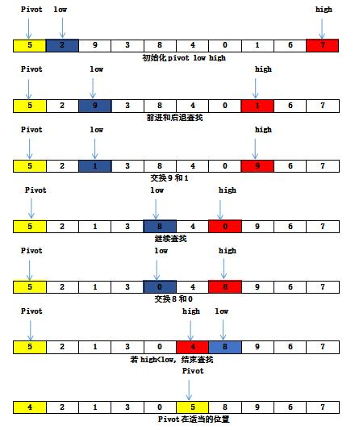

# Divide And Conquer
+ Divide the problem into a number of subproblems that are smaller instances of the same problem.
+ Conquer the subproblems by solving them recursively if the subproblem sizes are small enough, however, just solve the subproblems in a straightforward manner.

> 分而治之：将问题的一个实例划分为两个或者更多个较小的实例。这些较小的实例通常也是原问题的实例。如果可以轻松获得较小问题实例的答案，那通过合并这些答案，就能得出原实例的答案。

### 二分查找
```
index location(index low, index high){
	int mid;
    if(low > high)
    	return 0;
    else{
    	mid = (low + hiigh) / 2;
        if(x == S[mid])
        	return mid;
        else if(x < S[mid])
        	return location(low, mid - 1)
        else
        	return location(mid + 1, high);
    }
}
```

### 合并排序
我们用两路合并表示将两个有序数组合并为一个有序数组。重复应用此合并过程，
可以完成对一个数组的排序。

**合并排序步骤**
1. 将数组划分为两个各包含n/2个项目的子数组
2. 解决每个子数组，对其排序。除非数组足够小，否则以递推的方式完成此任务
3. 将子数组合并为单个有序数组，以合并这些子数组的答案

###### 算法：合并排序
+ 输入： 正整数n，数组S，其索引范围为1至n
+ 实现：
```
void mergesort(int n, keytype S[]){
	if(n > 1){
    	const int h = n / 2, m = n - h;
        keytype U[1..h], V[1..m];
        将S[1]至S[h]复制到U[1]至U[h];
        将S[h+1]至S[n]复制到V[1]至V[m];
        mergesort(h, U);
        mergesort(m, V);
        merge(h, m, U, V, S);
    }
}
```

###### 算法： 合并
+ 输入： 正整数h和m，有序数组U，索引范围是1至h，有序数组V，索引范围是1至m
+ 输出： 数组S，其索引范围是1至h+m， 在单个有序数组中包含了U和V中的键
+ 实现：

```
void merge(int h, int m, const keytype U[], const keytype V[],
                                            const keytype S[]){
	index i, j, k;
    i = 1; j = 1; k = 1;
    while(i <= h && j <= m){
    	if(U[i] < V[j]){
        	S[k] = U[i];
            i++;
        }else{
        	S[k] = V[j];
            j++
        }
        k++;
    }
    if(i > h)
    	将V[j]至V[m]复制到S[k]至S[h+m];
    else
    	将U[i]至U[h]复制到S[k]至S[h+m];
}
```

###### 算法： 合并排序2
```
void mergesort2(index low, index high){
	index mid;
    if(low > high){
    	mid = (low + high) / 2;
        mergesort2(low, mid);
        mergesort2(mid+1, high);
    	merge2(low, mid, high);
    }
}
```

###### 算法： 合并2
```
void merge2(index low, index mid, index high){
    index i, j, k;
    keytypeU[low..high];
    
    i = low, j = mid + 1, k = low;
    while(i <= mid && j <= high){
    	if(S[i] < S[j]){
        	U[k] = S[i];
            i++;
        }else{
        	U[k] = S[j];
            j++;
        }
        k++;
    }
    if(i > mid)
    	将S[j]至S[high]移至U[k]至U[high];
    else
    	将S[i]至S[mid]移至U[k]至U[high];
        
    将U[low]至U[high]移至S[low]至S[high];
}
```

### 快速排序



```
void quicksort(index low, index high){
	index pivotpoint;
    
    if(high > low){
    	partition(low, high, pivotpoint);
        quicksort(low, pivotpoint - 1);
        quicksort(pivotpoint + 1, high);
    }
}
```

###### 分割
+ 输入： 两个索引， low和high
+ 输出： pivotpoint，索引范围为low和high的子数组的枢纽点
+ 实现：

```
void partition(index low, index high, index& pivotpoint){
	index i, j;
    keytype pivotitem;
    
    pivotitem = S[low];    //为pivotitem选择第一项
    j = low;
    for(i = low + 1; i <= high; i++){
    	if(S[i] < pivotitem){
        	j++;
            交换S[i]和S[j];
        }
    }
    pivotpoint = j;
    交换S[low]和S[pivotpoint];         //将pivotitem放在pivotpoint
    
}
```

