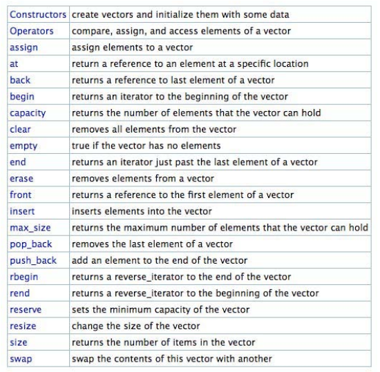

### Namespaces
>an abstract space that contains a set of names
>useful for resolving naming conflicts

```
namespace ford {
class SUV {
 ...
 };
}
namespace dodge {
 class SUV {
 ...
 };
}
int main() {
ford::SUV s1 = new ford::SUV();
dodge::SUV s2 = new dodge::SUV();
 ...
}
```

使用namespaces时要注意
```
namespaces ford{
	class SUV{
    	...
    };
    class Compact{
    	...
    };
}

int main() {
	using namespace ford;    //会同时暴露SUV和Compact
    SUV s1 = new SUV();
    ...
}

//较好的方式是只暴露出你需要用到的名字
int main() {
	using ford::SUV;
    SUV s1 = new SUV();
}
```
像`string, vector, iostream`等标准库所在的命名空间是`std`
可以像这样`using namespace std;`引入所有`std`名称空间，但是这样是很危险的。
**经验之谈：**
using `std::string` instead of `using namespace std`
include `using...` only in the .cc file, not in the header

### Standard Template Library(STL)
>a set of commonly used data structures & algorithms
>parameterized with types

**Some useful ones include:**
>vector
>map
>stack, queue, priority_queue
>sort



### Copying objects
**Default copy constructor**
>automatically generated by the compiler
>copies all non-static members(primitives & objects)
>invokes the copy constructor of member objects

```
MITPerson::MITPerson(const MITPerson& other){
	name = other.name;
	id = other.id;
	address = other.address;
}
```

**Copy assignment operator**
```
MITPerson& MITPerson::operator=(const MITPerson& other){
	name = other.name;
	id = other.id;
	address = other.address;
    return *this; // returns a newly assigned MITPerson
}
```
如果我们不定义，编译器会自动帮我们生成拷贝赋值操作符
那我们为什么要自己定义拷贝构造函数和拷贝赋值操作符呢？
```
class B {
	public:
		void print() { std::cout << "Hello World!\n”; }
};
class A {
	B* pb;
	int x;
 	public:
		A(int y) : x (y) { pb = new B(); }    //Double free!
		~A() { delete pb; } // destructor
		void printB() { pb->print(); }
};
void foo(A a) {
	a.printB();
}
int main() {
	A a1(5);
	a1.printB();
	foo(a1);
	return 0;
}
```
对比一下
```
class B {
	public:
		void print() { std::cout << "Hello World!\n”; }
};
class A {
	B* pb;
	int x;
	public:
		A(int y) : x (y) { pb = new B(); }
		A(const A& other) { // copy constructor
			x = other.x;
			pb = new B();
		}
		~A() { delete pb; } // destructor
		A& operator=(const A& other) { // copy assignment operator
			x = other.x;
            delete pb; //clean up the junk in the existing object!
			pb = new B();
			return *this;
 }
void printB() { pb->print(); }
};
```
>If you define any one of the three in a class, then you
>should define all three (you will probably need them!)
>*destructor*
>*copy constructor*
>*copy assignment operator*
