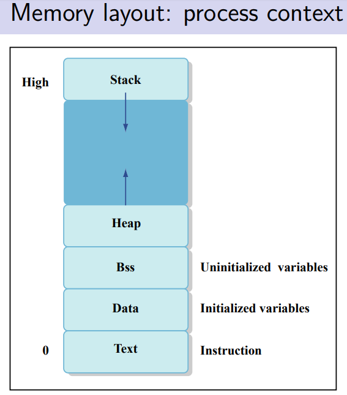
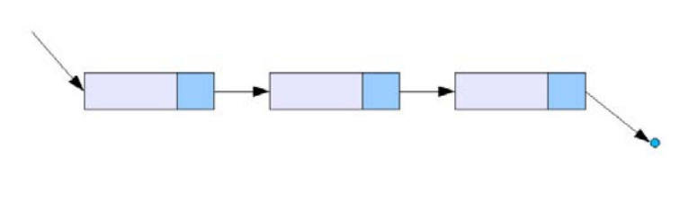

# 深入理解Malloc和New

C语言是imperative和compiled的，需要手动管理内存
C语言允许程序员是在heap上分配额外的内存，可以把heap想象成一个巨大的数组，我们可以用指针操作heap
标准库stdlib.h包含malloc和free函数
C函数在stack上分配内存，当函数执行时推入stack，函数返回时pop出stack，函数能访问栈顶以下已分配的部分。




|Stack|Heap
---|:--:|---:
分配内存|进入函数时|用malloc
回收内存|函数返回时|用free
分配地址|静态地|动态地

###### Allocation
`int* p = malloc(sizeof(int))`
###### Statically allocated arrays
`int arr[5]; arr[1] = 6;`
###### Dynamically allocated arrays
`int* arr; arr = malloc(sizeof(int)*5); arr[1] = 5;`
###### Defining a struct
```
struct pair{
	int first;
	int second;
}

//Statically allocated structs
struct pair p1;
p1.fisrt = 0;

//Dynamically allocated structs
struct pair* pp = malloc(sizeof(struct pair));
(*pp).first = 2;
pp->second = 3;
```
###### typedef
```
typedef struct pair pair_t;
pair_t p;

typedef struct pair{
	int first;
    int second;
}pair_t;
```
###### Deallocation
`free(p)`

#### Singly linked list


```
struct node{
	int val;
    struct node* next;
};
typedef struct node node_t;

//Creating nodes on the heap
node_t* make_node(int val){
	node_t* new_node = malloc(sizeof(node_t));
    new_node->val = val;
    new_node->next = NULL;
    return new_node;
}

//Inserting at the head of a linked list
node_t* insert_val(int val, node_t* cur_head){
	node_t* new_node = make_node(val);
    new_node->next = cur_head;
    return new_node;
}

Inserting at the end of a linked list
node_t* push_back_val(int val, node_t* tail){
	node_t* new_node = male_node(val);
    tail->next = new_node;
    tail = new_node;
    return tail;
}

//Deleting a value
node_t* delete_val(int val, node_t* cur_head, int* succeeded){
	*succeeded = 0;
    if(cur_head == NULL)
    	return NULL;
    else if(cur_head->val == val){
    	node_t* new_head = cur_head->next;
        free(cur_head);
        *succeeded = 1;
        return new_head;
    }else{
    	...
    }
}
```


#### Memory errors
```
int* i = NULL;
*i = 3;                  //Segmentation fault

struct pair{
	int first;
    int second;
};
struct pair* pp = NULL;
pp->first = 1;          //Segmentation fault

struct pair* pp = malloc(sizeof(struct pair));
pp = NULL;
free(pp);              //Memory leak!

int* i = NULL;
free(i);              //Freeing NULL does nothing
```

#### Buggy Example
```
int* get_array(int* len){
	*len = 3;
    int* arr = malloc(sizeof(int) * 3);
    arr[0] = 1; arr[1] = 2; arr[2] = 3;
    return arr;
}
int main(){
	int len, i;
    int* arr = get_array(&len);
    for(i=0; i<len; i++){
    	printf("%d\n", arr[i]);
    }
    return 0;
}
```

#### In-place linked list reversal
```
Element* reverse(Element *pHead){
	if(pHead == NULL || pHead->next == NULL) return pHead;
	Element* pCur = pHead;
    Element* pRev = NULL;
    while(pCur != NULL){
    	Element *pTemp = pCur;
        pCur = pCur->next;
        pTemp->next = pRev;
        pRev = pTemp;
    }
    return pRev;
}
```

### Struct Memory & Unions Memory
>Struct size != sum of member sizes
>All members must "algin" with largest member size
>Each member has own alignment requirements

###### Blackboard Example:
```
struct X{
	char a;   //1-byte, must be 1-byte aligned
	short b;  //2-bytes, must be 2-byte aligned
	int c;    //Biggest member (4-bytes).X must be 4-byte aligned
	char d;
}
```

>Can only access one member at a time.Union stores all data in same chunk of memory

```
union data{
	int x; char y;
};
union data mydata;
mydata.y = 'a';
mydata.x = 1;
printf("%d\n", mydata.x)     //Will print out 1
```
###### Union的用处：
1、创建别名。别名是内存对象原名之外的其他名字。比如在程序中经常会用到将一个数据类型强制转换为另一个类型，这个操作可以使用联合来代替。
2、使用联合来将较大的对象分解成组成这个对象的各个字节。（尤其在单片机编程中将float拆解成char)

